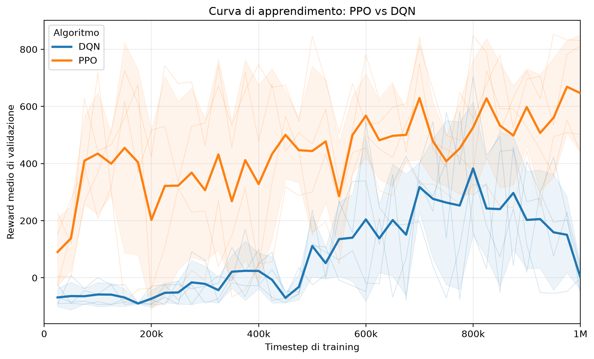
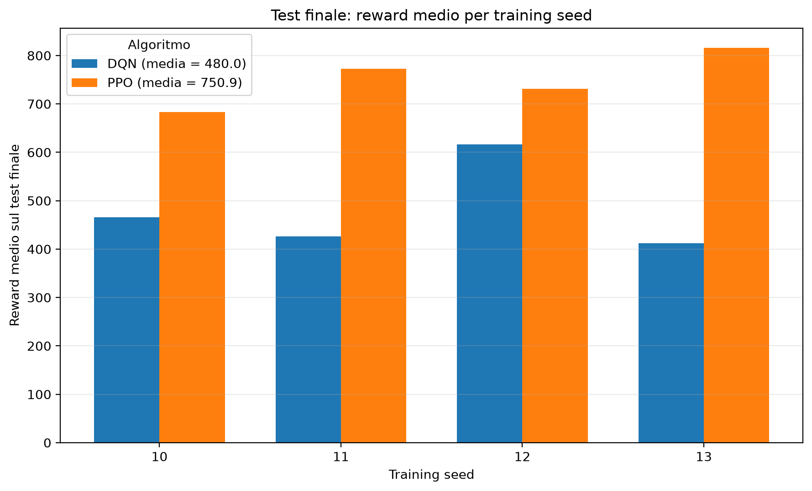
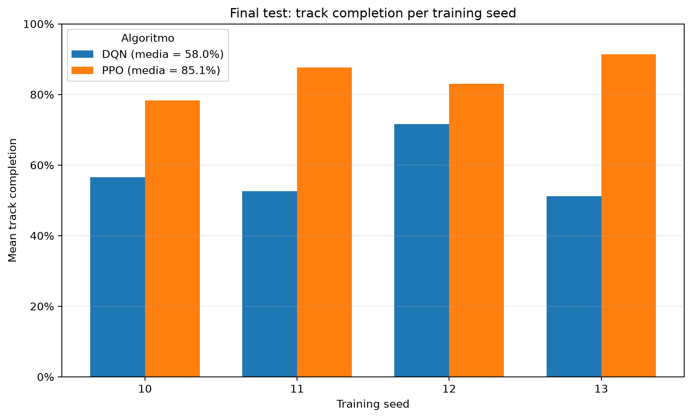
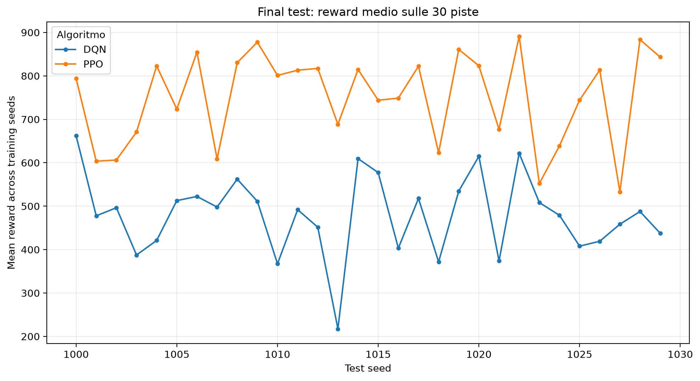

# Reinforcement Learning per CarRacing

Confronto sperimentale tra **Proximal Policy Optimization (PPO)** e **Deep Q-Network (DQN)** sull'ambiente visuale `CarRacing-v2` di Gymnasium.

Il progetto studia il comportamento dei due algoritmi in condizioni il più possibile omogenee, utilizzando lo stesso ambiente, lo stesso spazio delle azioni, la stessa rappresentazione visuale e un protocollo comune di training, validation e test.

> **Risultato principale:** nella configurazione sperimentale studiata, PPO ha ottenuto prestazioni superiori a DQN sia in termini di reward medio sia di percentuale di pista percorsa, mostrando inoltre una minore variabilità tra training seed.

---

## Obiettivo

`CarRacing-v2` è un ambiente di Reinforcement Learning nel quale un agente deve imparare a guidare un veicolo lungo circuiti generati proceduralmente.

L'agente osserva direttamente immagini RGB della scena e deve imparare a:

- riconoscere implicitamente la struttura della pista;
- mantenere il veicolo sulla carreggiata;
- scegliere le azioni di controllo;
- massimizzare la reward cumulativa.

Il confronto è stato effettuato tra:

- **PPO — Proximal Policy Optimization**, algoritmo on-policy actor-critic;
- **DQN — Deep Q-Network**, algoritmo off-policy value-based.

Le implementazioni degli algoritmi sono quelle fornite da **Stable-Baselines3**. Il lavoro del progetto riguarda la costruzione dell'intera pipeline sperimentale attorno agli algoritmi: configurazione dell'ambiente, tuning, training multi-seed, checkpoint, recovery, validation, selezione del best model, evaluation finale, aggregazione e analisi dei risultati.

---

## Ambiente

L'ambiente utilizzato è:

```python
ENV_ID = "CarRacing-v2"
CONTINUOUS = False
LAP_COMPLETE_PERCENT = 0.95
DOMAIN_RANDOMIZE = False
MAX_EPISODE_STEPS = 1000
```

### Osservazioni

Ogni osservazione è un'immagine RGB:

```text
96 × 96 × 3
```

Entrambi gli algoritmi utilizzano una `CnnPolicy`, che estrae automaticamente feature visuali dai pixel.

```text
Immagine RGB 96×96×3
        │
        ▼
       CNN
        │
        ▼
Feature visuali
    ┌───┴───┐
    ▼       ▼
   PPO     DQN
```

### Spazio delle azioni

È stata utilizzata la versione **discreta** di CarRacing:

1. nessun comando;
2. sterza a sinistra;
3. sterza a destra;
4. accelera;
5. frena.

La scelta permette di confrontare PPO e DQN utilizzando lo stesso action space. DQN, nell'implementazione Stable-Baselines3 utilizzata, richiede infatti uno spazio delle azioni discreto.

---

## Algoritmi

### DQN

DQN approssima la funzione:

\[
Q(s,a)
\]

e seleziona l'azione con Q-value maggiore, introducendo esplorazione durante il training tramite una strategia epsilon-greedy.

Configurazione principale:

```text
learning_rate              = 0.0001
buffer_size                = 10_000
learning_starts            = 500
batch_size                 = 32
tau                        = 1.0
gamma                      = 0.99
train_freq                 = 4
gradient_steps             = 1
target_update_interval     = 10_000
exploration_initial_eps    = 1.0
exploration_final_eps      = 0.05
exploration_fraction       = 0.5
max_grad_norm              = 10.0
optimize_memory_usage      = False
```

Il replay buffer è stato limitato a `10_000` transizioni per contenere l'utilizzo di memoria dovuto alle osservazioni visuali.

### PPO

PPO è un algoritmo actor-critic on-policy. L'actor rappresenta la policy:

\[
\pi_\theta(a|s)
\]

mentre il critic stima il valore dello stato:

\[
V(s)
\]

Sono stati mantenuti sostanzialmente gli hyperparameter standard di Stable-Baselines3:

```text
learning_rate       = 0.0003
n_steps             = 2048
batch_size          = 64
n_epochs            = 10
gamma               = 0.99
gae_lambda          = 0.95
clip_range          = 0.2
normalize_advantage = True
ent_coef            = 0.0
vf_coef             = 0.5
max_grad_norm       = 0.5
use_sde             = False
```

---

## Protocollo sperimentale

Uno degli aspetti principali del progetto è la separazione tra **tuning**, **validation** e **test finale**.

| Fase | Seed | Utilizzo |
|---|---:|---|
| Pilot / tuning | training `0–4` | scelte preliminari e tuning |
| Validation usata nel tuning | `100–104` | selezione preliminare |
| Training finale | `10, 11, 12, 13` | 4 run indipendenti per algoritmo |
| Validation finale | `200–204` | selezione del best checkpoint |
| Test finale | `1000–1029` | 30 piste non usate per tuning o model selection |

Le piste usate durante il tuning non sono state riutilizzate come test finale.

### Training finale

Sono state eseguite:

```text
4 run PPO
4 run DQN
```

per un totale di **8 training finali**.

Ogni run utilizza un budget nominale di:

```text
1.000.000 environment step
```

La validation viene eseguita ogni:

```text
25.000 step
```

sui cinque seed:

```text
200 201 202 203 204
```

Il modello utilizzato nel test finale non è necessariamente quello all'ultimo timestep: per ogni run viene selezionato il **best checkpoint**, cioè quello con reward medio di validation più elevato.

---

## Tuning DQN

Il tuning principale ha riguardato `exploration_fraction`.

Sono state confrontate le configurazioni `0.1` e `0.5` su cinque training seed appaiati.

| Training seed | fraction 0.1 | fraction 0.5 | Migliore |
|---:|---:|---:|---|
| 0 | 132.33 | 92.14 | 0.1 |
| 1 | 146.09 | 275.76 | 0.5 |
| 2 | 62.96 | 30.81 | 0.1 |
| 3 | 13.66 | 72.87 | 0.5 |
| 4 | 91.93 | 109.41 | 0.5 |

Riepilogo:

```text
Media best reward
0.1 → 89.39
0.5 → 116.20

Vittorie seed-per-seed
0.1 → 2/5
0.5 → 3/5
```

La configurazione finale è quindi:

```text
exploration_fraction = 0.5
```

La scelta è stata congelata prima del protocollo finale.

---

## Evaluation finale

Ogni best model è stato valutato sulle stesse **30 piste di test**, generate dai seed:

```text
1000 ... 1029
```

La policy viene utilizzata in modalità deterministica.

Numero totale di episodi:

```text
2 algoritmi
× 4 training seed
× 30 test track
= 240 episodi
```

I controlli di integrità hanno verificato:

- 30 episodi per ogni combinazione algoritmo/training seed;
- nessun duplicato;
- stessi test seed per tutti i modelli;
- utilizzo dei best model;
- evaluation deterministica.

---

## Risultati

### Prestazioni complessive

| Metrica | PPO | DQN |
|---|---:|---:|
| Training seed | 4 | 4 |
| Episodi di test | 120 | 120 |
| Reward medio | **750.85** | **480.04** |
| Std reward tra training seed | **56.72** | **93.51** |
| Track completion media | **85.11%** | **58.00%** |
| Giri completati | **7/120** | **0/120** |

La differenza di reward è:

```text
750.85 - 480.04 = +270.82
```

pari a circa:

```text
+56.42%
```

rispetto al reward medio di DQN.

La differenza nella percentuale media di pista percorsa è:

```text
85.11% - 58.00% = +27.11 punti percentuali
```

### Confronto tra training seed

| Training seed | DQN | PPO | Migliore |
|---:|---:|---:|---|
| 10 | 465.43 | 683.24 | PPO |
| 11 | 426.25 | 772.62 | PPO |
| 12 | 616.18 | 731.59 | PPO |
| 13 | 412.29 | 815.95 | PPO |

PPO risulta quindi migliore in:

```text
4 / 4 training seed
```

Inoltre:

```text
peggior PPO = 683.24
miglior DQN = 616.18
```

Nel campione di training finali considerato, gli intervalli delle medie per-run non si sovrappongono.

### Confronto sulle piste di test

Mediando i quattro modelli di ciascun algoritmo su ogni test track:

```text
PPO migliore: 30 / 30 piste
DQN migliore:  0 / 30 piste
```

Considerando invece i singoli confronti appaiati:

```text
training seed × test track
```

si ottiene:

```text
PPO migliore: 106 / 120
DQN migliore:  14 / 120
Pareggi:         0 / 120
```

Il vantaggio di PPO non è quindi dovuto a un numero ristretto di piste particolarmente favorevoli.

---

## Learning curve

La curva di validation mostra l'evoluzione delle prestazioni durante il milione di environment step.



La linea rappresenta la media sui quattro training seed, mentre la dispersione mostra la variabilità tra run.

DQN presenta una marcata regressione della validation nella fase finale del training: a `1.000.000` step il reward medio di validation scende a circa `2.11`.

Questo non contraddice il risultato del test finale, perché il test viene effettuato sul **best checkpoint selezionato durante il training**, non necessariamente sul modello all'ultimo timestep.

---

## Grafici finali

### Reward per training seed



### Track completion per training seed



### Reward sulle 30 piste finali



I grafici sono prodotti da `src/plot_results.py` utilizzando esclusivamente i dati già aggregati.

---

## Analisi statistica descrittiva

L'analisi finale è volutamente basata su statistiche semplici e facilmente interpretabili:

- media;
- mediana;
- deviazione standard;
- minimo e massimo;
- differenze PPO-DQN;
- conteggio delle vittorie.

La deviazione standard tra training seed è:

```text
PPO = 56.72
DQN = 93.51
```

Nella configurazione studiata PPO mostra quindi una minore variabilità delle prestazioni al variare del training seed.

Gli episodi individuali non vengono interpretati come 120 training indipendenti: il training seed rimane l'unità principale per valutare la variabilità dovuta al processo di apprendimento.

---

## Confronto qualitativo

Oltre all'analisi quantitativa è stato prodotto un confronto video tra PPO e DQN sulla stessa pista.

Configurazione del confronto:

```text
Training seed: 10
Test track:    1005
```

Prestazioni registrate:

```text
DQN → reward ≈ 482.82
PPO → reward ≈ 654.60
```

La pista `1005` è stata scelta perché rappresentativa delle prestazioni medie e non come caso estremo favorevole a uno dei due algoritmi.

Entrambi gli episodi raggiungono il limite massimo di `1000` step prima del completamento formale del giro.

Se il video è versionato nella repository:

[Confronto video DQN vs PPO — seed 10, track 1005](videos/final_comparison/dqn_vs_ppo_seed10_track1005.mp4)

---

## Struttura del progetto

```text
src/
├── env.py
├── train.py
├── evaluate.py
├── aggregate_results.py
├── plot_results.py
├── statistical_analysis.py
└── random_agent.py
```

Principali directory generate durante gli esperimenti:

```text
logs/
models/
best_models/
checkpoints/
recovery/
results/
aggregated_results/
statistical_analysis/
plots/
videos/
```

### Ruolo dei file principali

- `env.py` — configurazione comune di `CarRacing-v2`;
- `train.py` — training PPO/DQN, validation, checkpoint, recovery e resume;
- `evaluate.py` — evaluation deterministica e registrazione video;
- `aggregate_results.py` — aggregazione e controllo di integrità dei risultati;
- `plot_results.py` — generazione dei grafici finali;
- `statistical_analysis.py` — analisi statistica descrittiva;
- `random_agent.py` — test iniziale dell'ambiente.

---

## Output dell'aggregazione

`aggregate_results.py` produce:

```text
aggregated_results/
├── aggregation_report.json
├── combined_test_episodes.csv
├── learning_curve_algorithm.csv
├── learning_curve_per_run.csv
├── test_algorithm_summary.csv
├── test_paired_seed_comparison.csv
├── test_per_run_summary.csv
├── test_per_track_summary.csv
└── training_run_summary.csv
```

Nel protocollo finale l'aggregazione ha verificato:

```text
Training finali:                  8
Episodi di test:                240
Learning curve per-run:         320 punti
Learning curve per algoritmo:    80 punti
Warning:                          0
Strict mode:                   True
```

---

## Esecuzione

### Training finale

Esempio PPO:

```powershell
python src\train.py --algo ppo --timesteps 1000000 --seed 10 --run-type final --eval-freq 25000 --eval-seeds 200 201 202 203 204
```

Esempio DQN:

```powershell
python src\train.py --algo dqn --timesteps 1000000 --seed 10 --run-type final --eval-freq 25000 --eval-seeds 200 201 202 203 204
```

### Evaluation finale

Esempio:

```powershell
python src\evaluate.py --algo ppo --model best_models\ppo_final_1M_seed_10\ppo_final_1M_seed_10_best.zip --train-seed 10 --episodes 30 --eval-seed-start 1000 --results-dir results\final_test
```

### Aggregazione

```powershell
python src\aggregate_results.py
```

### Grafici

```powershell
python src\plot_results.py
```

### Analisi statistica descrittiva

```powershell
python src\statistical_analysis.py
```

---

## Software utilizzato

| Componente | Versione |
|---|---:|
| Python | 3.11.9 |
| NumPy | 1.26.4 |
| Gymnasium | 0.29.0 |
| Stable-Baselines3 | 2.3.2 |
| PyTorch | 2.3.1+cpu |

Il training è stato eseguito su CPU.

Il wall-clock time non viene utilizzato come misura principale di confronto poiché le run sono state distribuite su computer con hardware differente. Il confronto utilizza invece il numero di **environment step**.

---

## Limiti dello studio

I risultati devono essere interpretati nel contesto specifico dell'esperimento.

In particolare:

- vengono confrontati soltanto PPO e DQN;
- entrambi operano nello spazio delle azioni discreto;
- PPO non viene valutato nella modalità continua, che potrebbe essere più naturale per il controllo di un veicolo;
- il numero di training seed finali è quattro per algoritmo;
- la domain randomization è disabilitata;
- la ricerca degli hyperparameter non è esaustiva;
- il test riguarda esclusivamente `CarRacing-v2`.

Di conseguenza il risultato non deve essere interpretato come:

> PPO è sempre migliore di DQN.

La conclusione supportata dai dati è:

> **Nella configurazione sperimentale adottata su CarRacing-v2, PPO ha mostrato prestazioni superiori e una minore variabilità tra training seed rispetto a DQN.**

---

## Conclusioni

Il progetto ha realizzato una pipeline completa e riproducibile per il confronto tra PPO e DQN in un task di controllo visuale.

Il protocollo finale comprende:

```text
8 training finali
4 training seed per algoritmo
1.000.000 environment step per run
5 piste di validation
30 piste di test
240 episodi di test complessivi
```

I risultati principali sono:

```text
Reward medio
PPO = 750.85
DQN = 480.04

Track completion media
PPO = 85.11%
DQN = 58.00%

Variabilità tra training seed
PPO std = 56.72
DQN std = 93.51

Confronto per training seed
PPO = 4/4

Confronto per pista, mediando sui training seed
PPO = 30/30
```

Nel protocollo sperimentale studiato, PPO è risultato quindi più efficace e più consistente di DQN sul task `CarRacing-v2`.

---

## Repository

Codice, script sperimentali e risultati:

**[FedericoRisoli/rl-car-racing](https://github.com/FedericoRisoli/rl-car-racing)**
